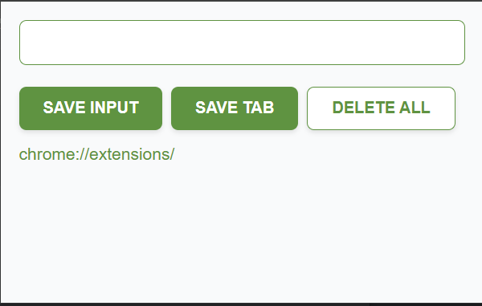
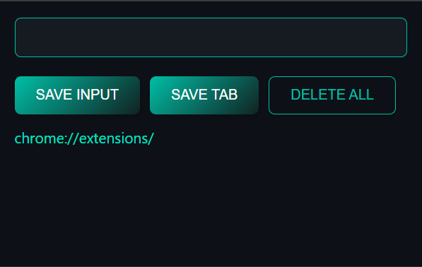

# Save Mate🤝  

Save Mate is a simple and powerful **Chrome Extension** that helps you save text inputs (as clickable links!) and current tab URLs in just one click and clear them all when you're done.  
It comes with **two beautiful themes – Light and Dark –** so you can choose what suits your mood. 🌗  
Perfect for quickly collecting notes, links, or anything you want to revisit later. 📝✨

## Features🚀 

- **Save Input as Link** – Any URL or text you type gets stored as a **clickable link**.
- **Save Current Tab** – Capture and save the active tab's title & URL instantly (also clickable).
- **Delete All** – One-click option to clear all saved data.
- **Persistent Storage** – Data stays saved even after closing the browser.
- **Dual Theme Support** – Choose between **Light Mode** ☀️ and **Dark Mode** 🌙.
- **Minimal & Clean UI** – Black + Teal dark theme & a clean light theme for a modern look.

## Preview📸 

| Light Theme ☀️ | 

    
  
| Dark Theme 🌙 |  

  

## 🛠 Installation (Developer Mode)

1. **Clone this repository** or **Download ZIP**:
   git clone https://github.com/Mehak-Fatimaa/Save-Mate.git

   Open Chrome and go to: chrome://extensions/

3. Enable Developer Mode (toggle in the top-right corner).

4. Click Load unpacked and select the Save Mate project folder.

5. Pin Save Mate from the extensions bar for quick access.

## Usage🧩 

1. Click on the **Save Mate** icon in the Chrome toolbar.
2. Type any URL or note in the input field and click **Save Input**.
3. The saved input will appear **as a clickable link** in the list below.
4. Or click **Save Current Tab** to store the active tab's title & URL (also clickable).
5. Click **Delete All** when you want to clear everything.

## Project Structure📂 

Save-Mate/  
├  
├── images/  
├    ├── icons.png  
├    ├── light_theme_demo.png  
├    ├── dark_theme_demo.png  
├── manifest.json   
├── index.html   
├── index.js   
├── light_theme.css   
├── dark_theme.css   
├── icon.png  
└── README.md

## 🖌 Theme

Save Mate comes with **two beautiful themes** so you can choose your vibe:

- **🌙 Dark Theme:** Sleek Black + Teal combo for a modern, focused look.
- **☀️ Light Theme:** Clean and minimal design with soft contrasts for daytime use.

> _Pro Tip:_ Switch between Light and Dark mode to match your mood!

## 🤝 Contributing

Found a bug or have an idea?  
Feel free to **fork this repo** and submit a **Pull Request**. 🚀
